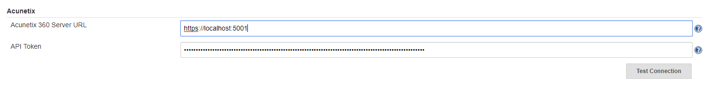
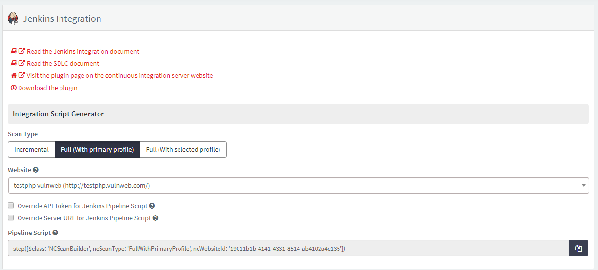
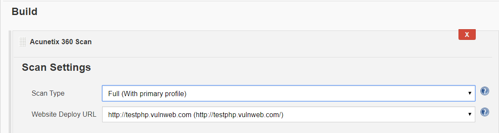
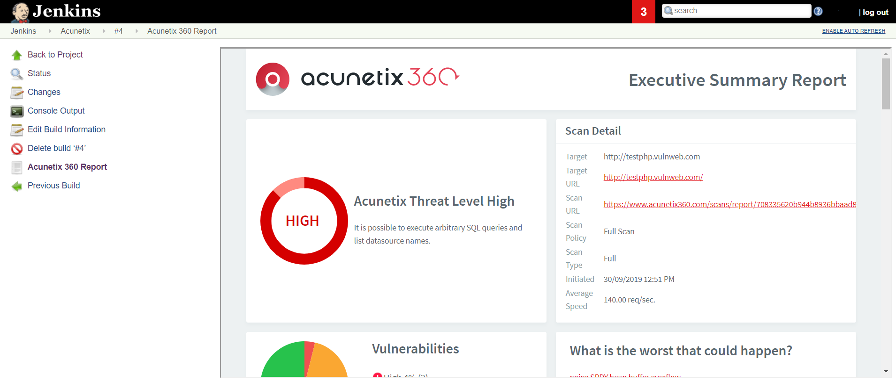

Acunetix 360 Scan Plugin
====================

## About this plugin

Allows users to start security scans via Acunetix 360 and see their
reports in Jenkins 

## Features

### Global Settings

Acunetix 360 plugin needs the admin user to define the API settings
only once.

### Global Settings Override

Global settings can be overridden in pipeline scripts by
giving ncApiToken and/or ncServerURL parameters.

#### Example Script

step([$class: 'NCScanBuilder', ncScanType: 'FullWithPrimaryProfile', ncWebsiteId: '19011b1b-4141-4331-8514-ab4102a4c135'])

### Scan Settings

Once you define global API settings, the plugin retrieves available
scan settings such as scannable website list and scan profile names. You
can easily select relevant settings.

  
### Scan Report

 Once your initiated scan is completed, you can easily see your
executive scan report on the build result window.

## Requirements

In order to use the Acunetix 360 scan plugin, following requirements
needs to be satisfied:

-   The user must have API token which has permission to start security
    scan.

-   The token belongs to the Acunetix 360 account must have at least one
    registered website. 

## User Guide

Acunetix 360 Jenkins Plugin documentation is available at:

<https://www.acunetix.com/support/docs/a360/integrations/installing-and-configuring-the-acunetix-360-scan-jenkins-plugin>

Acunetix 360 SDLC documentation is available at:

<https://www.acunetix.com/support/docs/a360/integrations/integrating-acunetix-360-into-your-existing-sdlc>
